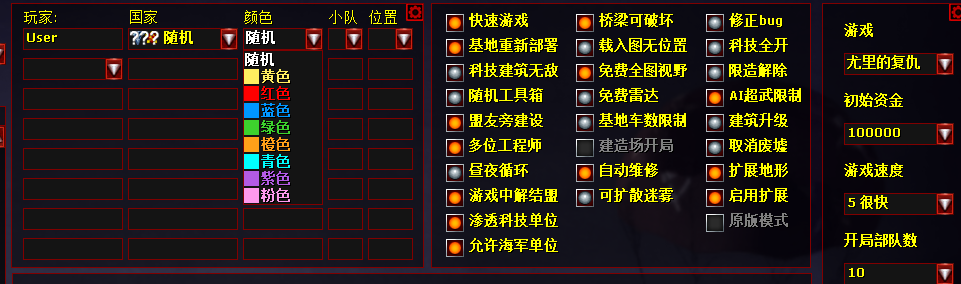
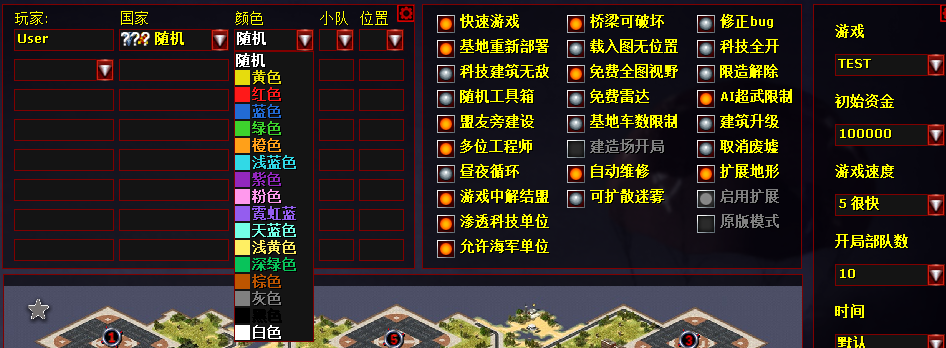

# Mod功能维护文档
## 支持新建新的遭遇战颜色 1.5.3.2新增
```
[ModID]
...
AllowColors=true;默认false,为True则启用这个功能
```
然后颜色在Mod文件的MPColors里面定义就像GameOptions.ini一样
按照
```
$颜色=R,G,B,Index    ;RGB颜色，第四位是对应uimd.ini里面定义的颜色序列，此处参考Ares文档里面去写
```

例子：
```
;这个功能只有在AllowColors=true时生效
[MPColors]
$黄色=230,220,13,0
$红色=255,25,25,1
$蓝色=34,107,212,2
$绿色=61,210,45,3
$橙色=255,160,25,4
$浅蓝色=49,217,230,5
$紫色=146,40,189,6
$粉色=255,153,237,7
$霓虹蓝=148,93,239,8
$天蓝色=115,255,231,9
$浅黄色=255,239,99,10
$深绿色=8,195,90,11
$棕色=189,85,0,12
$灰色=128,128,128,13
$黑色=0,0,0,14
$白色=255,255,255,15
```




